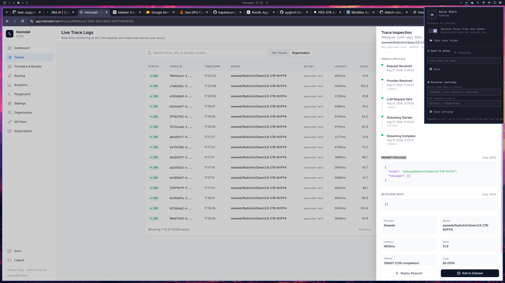

# omaShare

An [Omarchy](https://omarchy.dev) shell plugin that turns your Linux machine
into a [Quick Share](https://en.wikipedia.org/wiki/Quick_Share) (formerly
Nearby Share) receiver and sender for your Android phone — native to the bar.

- **Receive** files from your phone while the receiver runs; files land in
  `~/Downloads` (configurable) and you get a desktop notification.
- **Send** files from the machine to your phone from the same popup.
- **One engine, many monitors**: the receiver runs once per shell session
  (`service` entry point); each bar widget is a view onto it.


## How it works

The plugin drives [qs](https://github.com/martinalderson/qs)
(`martinalderson/qs`, GPL-3.0) — a small Rust CLI that implements the
Quick Share protocol — from a supervised bash helper:

```
Service.qml  ──spawns──▶  helpers/omashare-helper  ──supervises──▶  qs receive -y
   ▲                          │  ▲
   │ JSON events (stdout)     │  │ JSON commands (stdin): {"command":"shutdown"}
   └──────────────────────────┘  └──────────────────────────────────────────
BarWidget.qml (per monitor, view only)
```

The helper restarts a crashed receiver automatically (capped exponential
backoff) and emits one JSON event per line: `ready`, `listening`,
`transfer_starting`, `file_received`, `transfer_done`, `transfer_failed`,
`receiver_error`, `receiver_restarting`, `stopped`.

Teardown: when the shell exits, quickshell SIGKILLs the helper, so it
cannot run its own cleanup. The helper therefore spawns a small
stdin-forwarding subshell that survives the kill; when the helper's
command pipe closes it stops `qs` via a pid file, and the reader
subshells exit on their own. Scratch dirs are named after the helper's
PID, and leftovers from a SIGKILLed helper are reaped at the next start.

## Requirements

- Omarchy (Arch-based shell: Hyprland + Quickshell)
- The `qs` CLI — **use the omaShare fork**, which carries the receiver
  fixes phones need (upstream advertises mDNS records phones cannot
  resolve, so sends fail or crawl over Bluetooth):
  ```sh
  cargo install --git https://github.com/sorenmat/qs --branch omashare --bin qs
  ```
  (The plugin probes `~/.cargo/bin/qs`, `~/.local/bin/qs`, and then `PATH`,
  verifying each candidate by its `qs x.y.z` version banner — a `qs` on PATH
  that is actually Quickshell is skipped.)
- `jq`

## Install

```sh
# from a checkout of this repo
./install.sh
# or from a git remote
./install.sh --git https://github.com/<you>/omashare.git
omarchy restart shell
```

The widget lands on the right side of the bar.



To remove the plugin: `omarchy plugin remove smo.omashare`.

## Usage

- **Left-click** the bar icon — status popup:
  - receiver on/off toggle
  - current status, device name phones see, save folder (with an
    *Open save folder* button)
  - **Send to phone**: scan for nearby devices, pick one, enter a file path,
    *Send*
  - **Recent files** received this session — click one to open its folder
  - **Receiver settings**: device name shown on phones, destination folder
- **Right-click** the bar icon — toggle the receiver.
- Hover for a status tooltip.

On the phone: open Quick Share, make sure it is visible (e.g. *Visible to
everyone*), and pick this machine's name.

## Settings

Set via the popup or in `~/.config/omarchy/shell.json` under the bar layout
entry for `smo.omashare`:

| key | default | meaning |
| --- | --- | --- |
| `receiverEnabled` | `true` | keep the receiver running (discoverable) |
| `deviceName` | hostname | name shown in the phone's Quick Share picker |
| `destinationDir` | `~/Downloads` | where incoming files are saved |

## IPC

The service owns the `smo.omashare` IPC target (one handler, shared by all
monitors):

```sh
omarchy-shell smo.omashare status
omarchy-shell smo.omashare receiverToggle
omarchy-shell smo.omashare scanDevices
omarchy-shell smo.omashare open   # opens the popup on the focused monitor
```

## Development

```sh
node test/model.test.js      # pure-JS parser tests
bash test/helper.test.sh     # helper end-to-end with a fake qs
bash test/term.test.sh       # process-group TERM shutdown
bash test/eof.test.sh        # teardown: pipe EOF leaves no receiver behind
omarchy plugin validate .    # manifest schema check
```

## Notes & limitations

- Receiving runs `qs receive` with auto-accept (`-y`); the receiver is
  discoverable to everyone on the network while enabled.
- As of qs `a63bc7b` (Aug 2026), upstream `qs` advertises an unresolvable
  mDNS receiver record and phones fail with *waiting → failed*. Install
  `qs` from the fork instead: [`sorenmat/qs`, branch
  `omashare`](https://github.com/sorenmat/qs/tree/omashare) (which pulls
  patched [`rquickshare`](https://github.com/sorenmat/rquickshare/tree/omashare)
  and [`mdns-sd`](https://github.com/sorenmat/mdns-sd/tree/omashare));
  the individual fixes are documented in
  [`notes/qs-mdns-patches/`](notes/qs-mdns-patches/README.md) for
  upstreaming.
- Wi-Fi speed needs one firewall exception: phones connect directly to
  the receiver's advertised TCP port, which omaShare pins to 35353; a
  default-deny ufw drops that connect and the transfer falls back to
  BLE at ≈150 KB/s or fails. `sudo ufw allow in 35353/tcp` fixes it;
  details in [`notes/qs-mdns-patches/`](notes/qs-mdns-patches/README.md).
- Quick Share requires both sides on the same Wi-Fi (or a connected
  network); the phone decides visibility.
- The `recent files` list is per shell session.

## License

MIT
